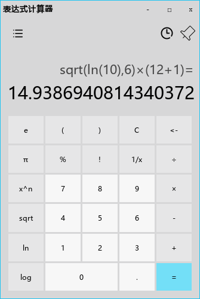

# 表达式计算器
表达式计算器是一个由C++ with QT编写的应用程序。这个计算器旨在通过引入表达式计算的概念解决Windows默认计算器显示不直观的问题，提供了普通型计算器、科学型计算器的功能，并且可以通过页面管理机制快速添加自定义的新页面。

## 特性
- 普通型计算器提供了基础的表达式四则运算功能，当按下计算按键时计算器将自动解析数学表达式并给出结果。
- 科学型计算器提供了乘方、开根、对数等运算，同时内置一个函数解析器，能够将表达式中形如sqrt(2)的数学函数解析为数字结果。
- 随机数生成器提供了三种随机数生成方式，C++98方式、C++11方式与CPU随机数生成器方式。其中前两者都为线性同余法生成的伪随机数，但是分别由C++98与C++11方法实现，后者生成最大范围较大。第三种方法调用RDRAND指令由CPU真随机数生成器生成随机数，此功能需要CPU硬件支持。
- 计算器历史记录功能，能够显示计算历史记录。
- 固定显示最前，最大化等窗口功能。
- 高精度功能，由高精度算法（[百度百科、](https://baike.baidu.com/item/%E9%AB%98%E7%B2%BE%E5%BA%A6%E8%AE%A1%E7%AE%97/2671214?fr=aladdin)[Wiki](https://en.wikipedia.org/wiki/Arbitrary-precision_arithmetic)）实现，可以进行`int64_t`与`long double`范围之外的数学运算，其中加减乘除由竖式运算规则实现，为精确解。乘方、开根、对数等运算会被拆解为`int64_t`与`long double`范围内数字，由QtMath库计算，为泰勒展开实现的近似解。

## 开始

环境需求
- Windows 10及以上 （QT6最低支持）
- MinGW （项目构建使用版本为11.2.0）
- 安装QT6（项目构建使用版本为6.2.0和6.3.0）
  - 前往QT官方网站[https://www.qt.io/zh-cn/](https://www.qt.io/zh-cn/)
  - 下载并且安装QT
  - 在GitHub上下载本项目源代码
  - 在QT Creator中打开[./cal.pro](./cal.pro)
  - 构建项目

## 项目结构
### 名称空间CalEngine
CalEngine内置了计算器所用到的算法，包括高精度算法、表达式的检验与计算、随机数生成等。
### 名称空间PageEngine
PageEngine内部是与页面有关的部分，包括一些自定义窗口控件、Windows API部分的封装、页面管理类等。

### 名称空间UI
UI内为此计算器的所有UI界面，包括头文件、源文件与UI文件。

## TODO
- 程序员型计算器
- 取余运算%的实现
- 概率论与统计计算器
- 一些代码规范性调整

## 项目文档
- [./Document/index.md](./Document/index.md)

## 贡献者
- [EMILIIIIA](https://github.com/EMILIIIIA) 项目组长，UI编写
- [ATRI-daisuki](https://github.com/ATRI-daisuki) 项目成员，负责表达式计算编写
- [asnijviasfjdj](https://github.com/asnijviasfjdj) 项目成员，负责高精度算法编写
## 开源许可证
Copyright (c) SCUTersLoveDiana. All rights reserved.\
Licensed under the [GPL v2.0](./LICENSE) License.
